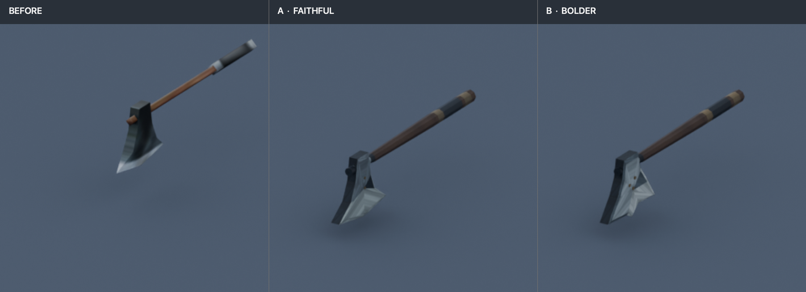
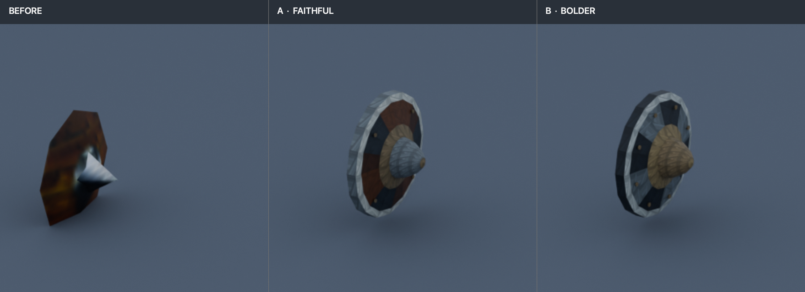
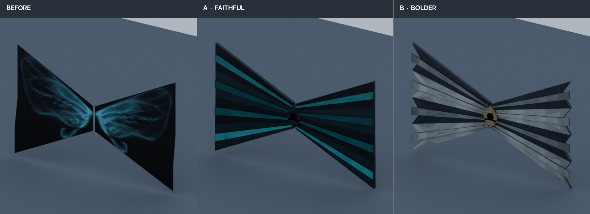

# Item style pilot: Axe01, Shield01 and Wing01

Prepared on `codex/items-style-pilot` from `origin/main` at `6f93a708`. These offline A/B studies let the owner choose a direction before any larger item pass. Each variant is kept beside its editable Blender source, exported game files and validation evidence.

## Review sheets

### Axe01 — hand weapon

### Shield01 — arm shield

### Wing01 — back attachment

## A/B comparison and recommendation

### Axe01

- **A — faithful, 358 triangles:** a more finely modeled crescent head and haft, with the original muted iron and brown handle identity. The 256×256 `Axes02` map adds painted edge and material definition.
- **B — bolder, 402 triangles:** a sharper, more stepped blade edge, stronger iron/brass separation and extra low profile socket pins. It keeps the recognizable head-and-haft layout.
- **Recommendation:** B, if the owner wants the axe head to read more clearly at play scale. The study camera is nearly edge-on to the head, so the distinction is modest in this view; decide whether that stronger profile and brass detail is worth carrying forward.
- **Open question:** Should the early axe remain understated, or should its blade edge and socket have the stronger iron/brass contrast of B?

### Shield01

- **A — faithful, 432 triangles:** a shaped convex shield with a brown face, steel rim, rear strap and compact boss. The palette stays close to the starter shield's wood-and-metal identity.
- **B — bolder, 560 triangles:** a more faceted iron face, stronger dark-steel planes, warmer boss and more pronounced rivets.
- **Recommendation:** A as the safer first request. It adds depth while keeping the brown face that distinguishes a basic shield; B is the clearer choice if the owner wants this family to move toward iron and brass.
- **Open question:** Keep the brown shield face as the family identity, or adopt B's more uniformly armored look?

### Wing01

- **A — faithful, 348 triangles:** two broad, continuous elfin panels with teal/cyan highlights and subtle raised vanes, preserving the original magical color identity.
- **B — bolder, 380 triangles:** the same paired wing layout with faceted feather tips, silver/charcoal planes and restrained brass at the root, following the proposed T1 palette.
- **Recommendation:** B for the requested T1 material direction and clearer feather silhouette. A is the safer pick if the teal/cyan look is a defining part of this wing.
- **Open questions:** Should Wing01 keep its teal magical color, or adopt the grounded T1 palette? Should the outer edge stay smooth as in A, or use B's feather points?

## Preserved contract and validation

All six exports retain one mesh in the original mesh slot, original game BMD and texture filenames, the existing texture names without adding render-flag suffixes, and their source armature/action structure. Blender source mesh transforms remain identity; local bounds match the study baseline within 0.005 units. The review renders apply the study's display-only recenter translation and do not move the asset origin.

| Model | Original → A / B triangles | Bones | Actions and keys | Texture, original → pilot |
|---|---:|---:|---:|---|
| Axe01 | 48 → 358 / 402 | 1, same order/name | 1 action, 1 key | `Axes02.jpg` / `Axes02.OZJ`, 32×32 → 256×256 |
| Shield01 | 18 → 432 / 560 | 1, same order/name | 1 action, 1 key | `du_shield1.jpg` / `du_shield1.OZJ`, 32×32 → 256×256 |
| Wing01 | 16 → 348 / 380 | 11, same order/names/parents | 1 action, 7 keys | `elfin_wing.jpg` / `elfin_wing.OZJ`, 64×64 → 256×256 |

Every variant is below the 1500-triangle item budget. All texture maps are 256×256, power-of-two, below 1024, and each `.OZJ` passes `mu_texture.py check`. For every variant, `bmdconv validate` passes on the exported mesh and action SMDs. `bmdconv compare` was run against the current original BMD and reports `DIFFERENT`, as expected for a geometry pilot; it reports matching mesh/bone/action counts, identical bone names and motion (`max bone distance: 0.0000`, `differing bone names: 0`). Full raw output and SHA-256 records are in each variant's `validation/` folder.

The baseline study lists same-name `elfin_wing.OZJ` alternatives under `Item/Ingameshop/` and `Player/`; this pilot changes only the model-local `Item/elfin_wing.OZJ`. Confirm during the future request that the separate alternatives should remain untouched.

## Files and limits of this review

Each `Axe01/{A,B}/`, `Shield01/{A,B}/` and `Wing01/{A,B}/` folder contains `source.blend`, the exported `<Model>.bmd`, the editable `.jpg`, the game `.OZJ`, and `validation/` outputs. Each model folder contains `review/before.png`, `review/A.png`, `review/B.png` and the sheet linked above. Source scenes retain the imported armature/action and a tagged original-mesh reference excluded from export.

All previews use the study's orthographic camera, scale 360, 1024×1024 framing and neutral studio lighting. The before images come from the study. Cropped review sheets make the assets easier to compare; full camera renders are retained in `review/`. These are offline renders only. Nothing was installed under `src/bin/Data`, and no in-client attachment, glow or gameplay check is claimed. The chosen variant should go through the item editor's request flow after owner review.
