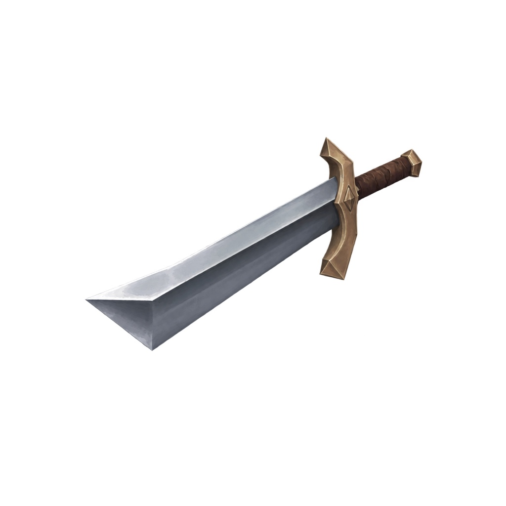
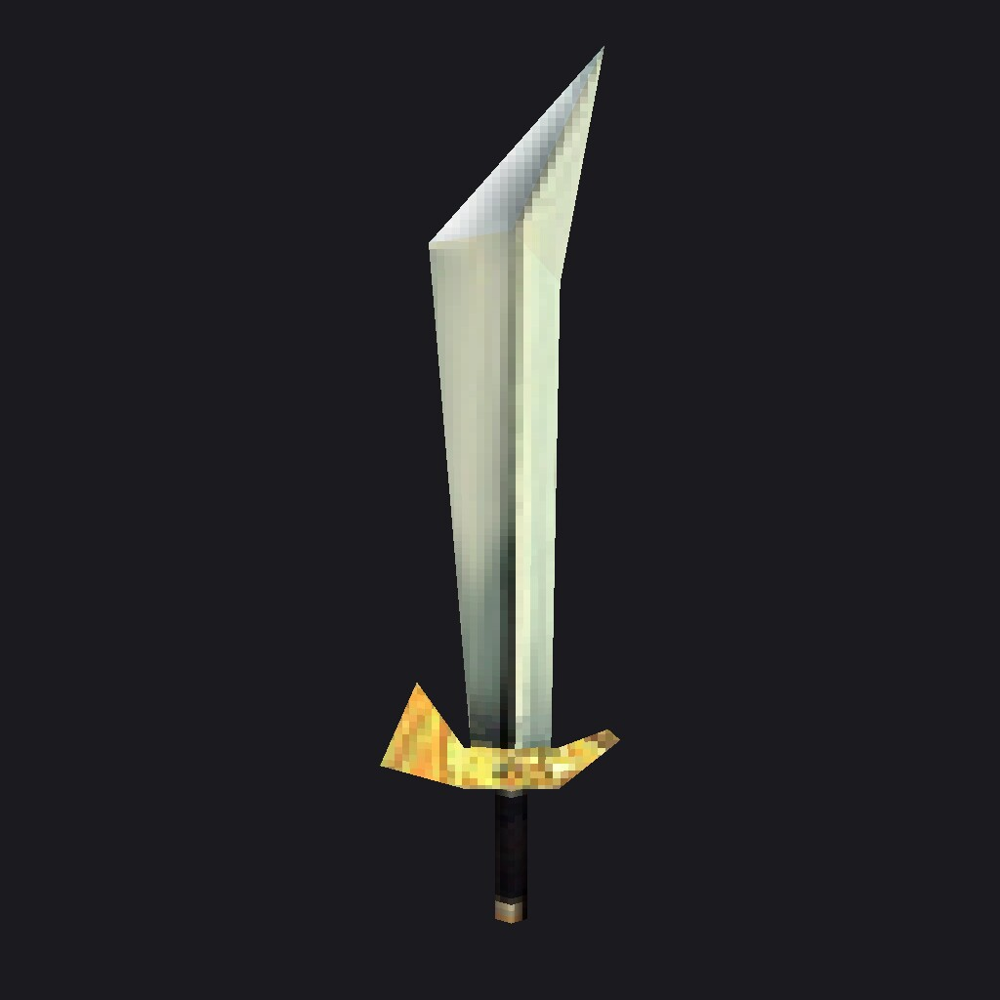
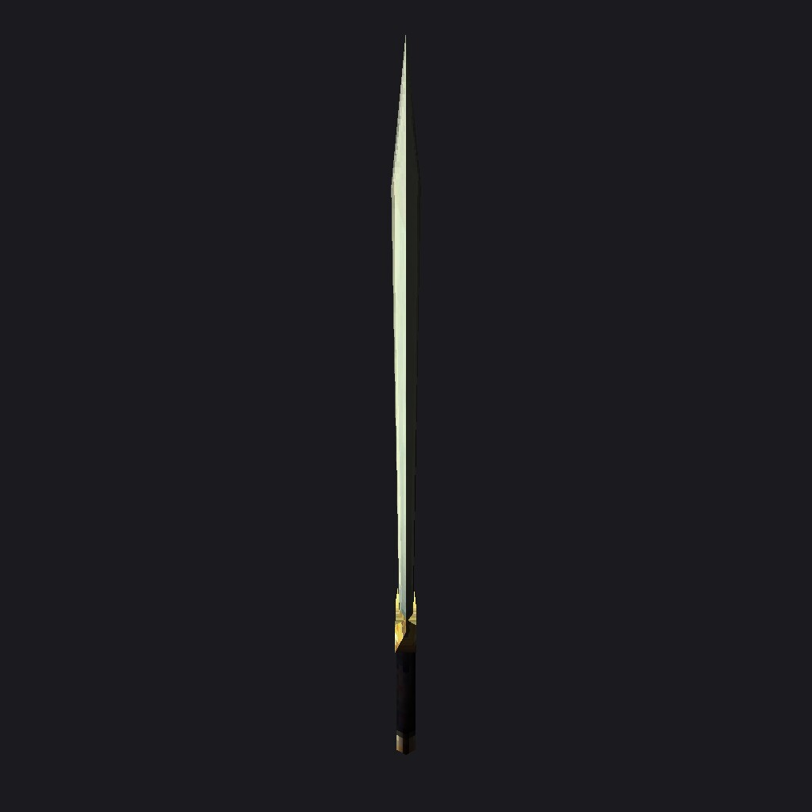
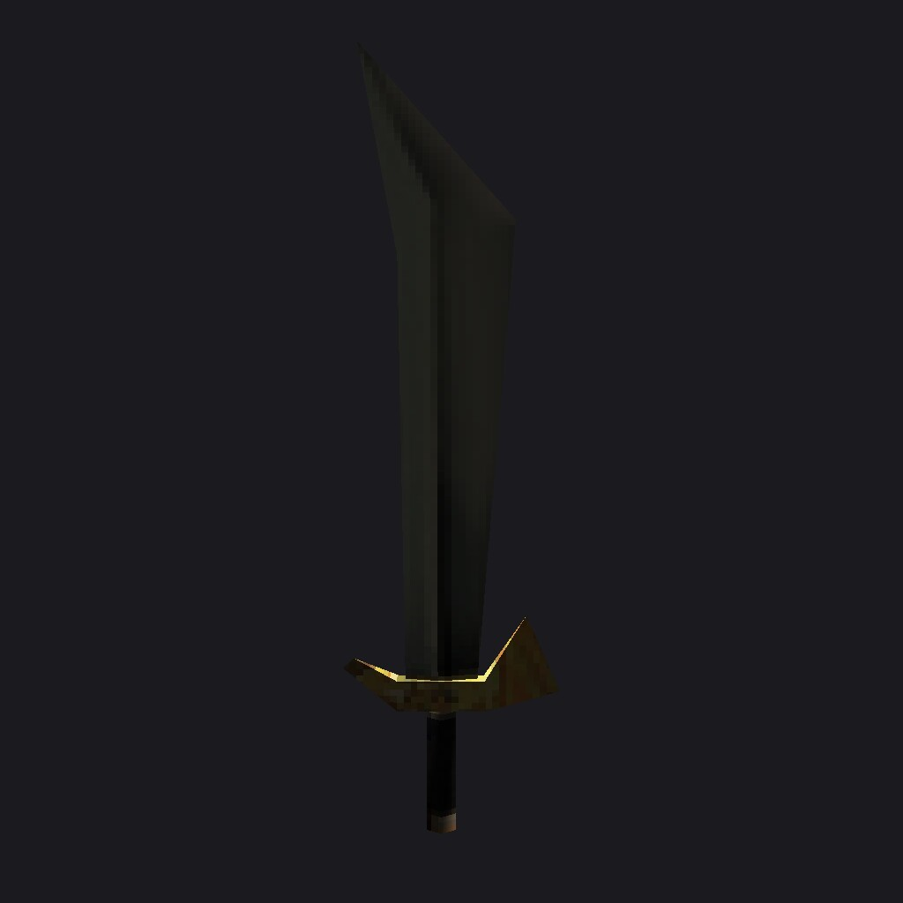
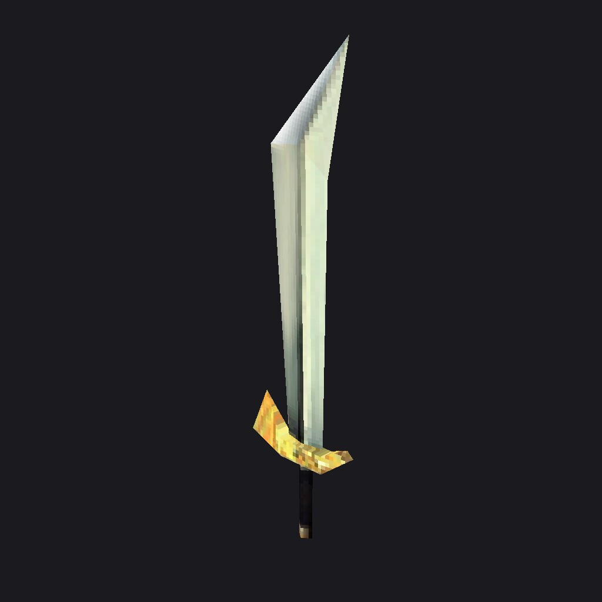
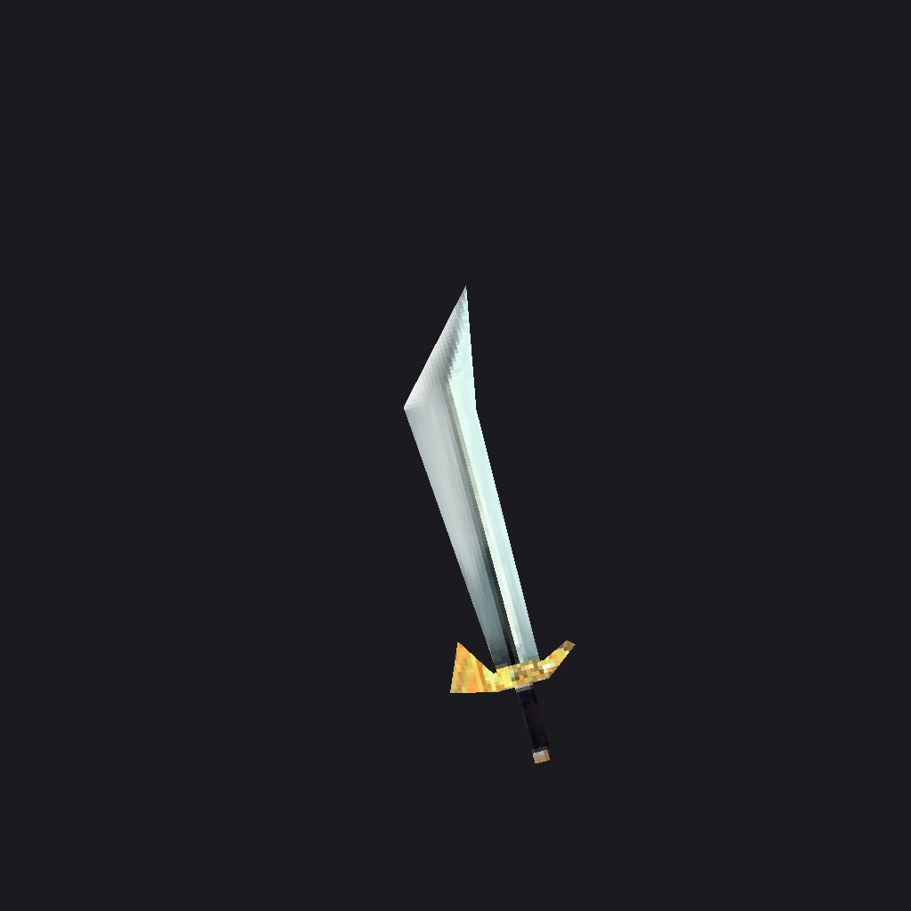
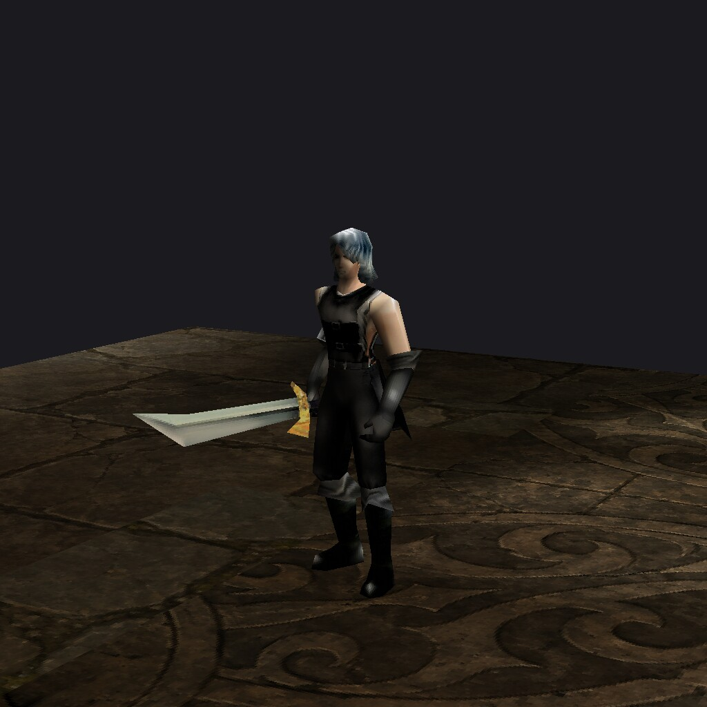
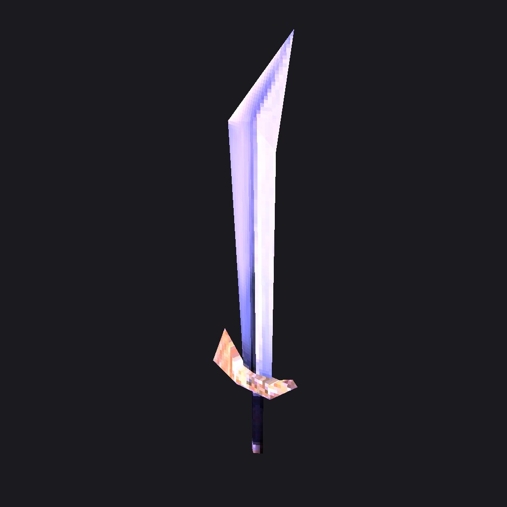
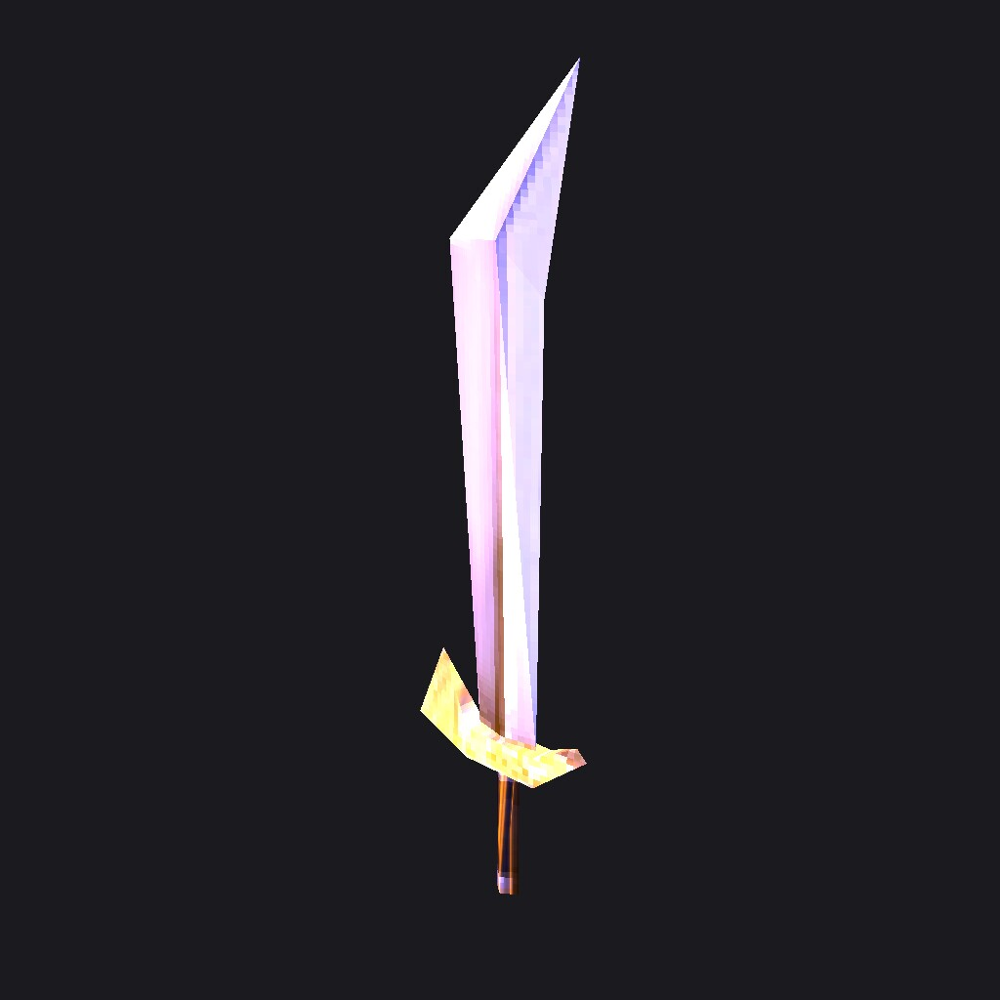
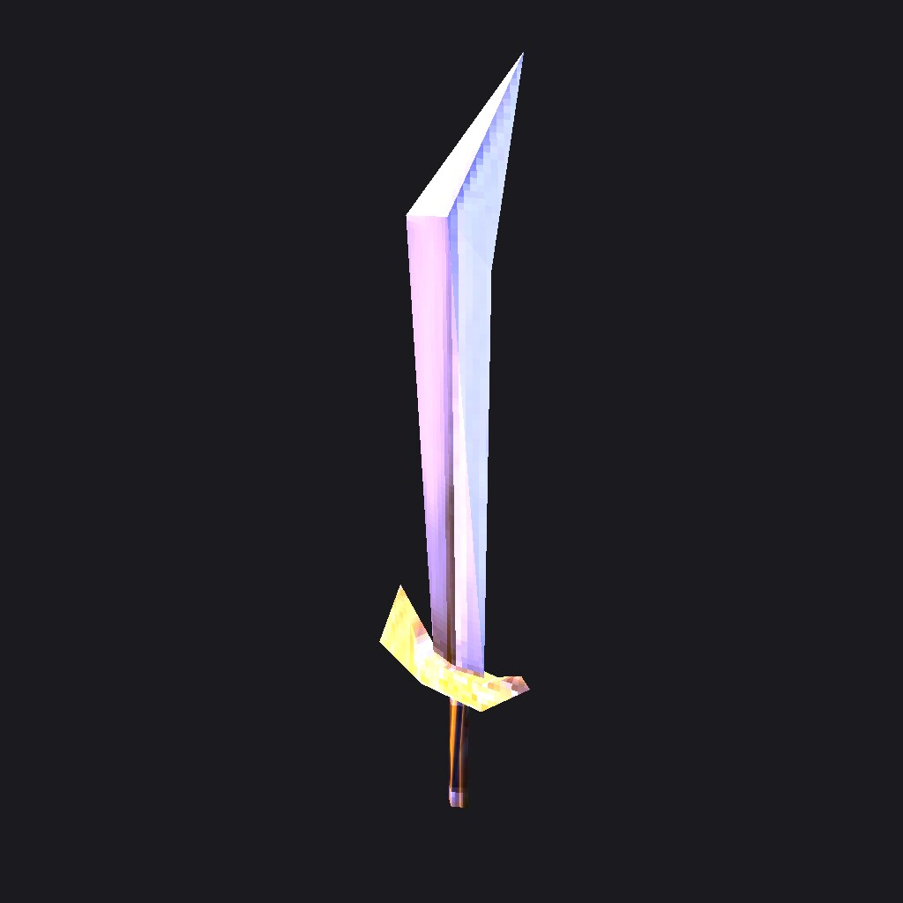

# Item request 2026-09-24-0-1-rebuild-short-sword-exactly

Rebuild Short Sword exactly as the picked concept

| | |
|---|---|
| Kind | redesign |
| Priority | normal |
| Status | open, filed 2026-09-24T14:34:10+02:00 from the item editor |
| Base commit | `616cdf2adcb8ad60b0a65f1f30797861ff9f12ed` |
| Branch | `codex/item-req-0-1-rebuild-short-sword-exactly` |
| Deliver to | `assets-work/Items/requests/2026-09-24-0-1-rebuild-short-sword-exactly/delivery/` |
| Push allowed | no |

`request.json` next to this file is the contract; this brief repeats it for people. Work as [ASTRA.md](../../../../ASTRA.md) (weapons, armour) and the [worker rules](../README.md#worker-rules-codex) describe, and check the folder with
`python3 assets-work/Items/requests/validate_request.py assets-work/Items/requests/2026-09-24-0-1-rebuild-short-sword-exactly`.
The item keeps its group, index and file names; its name, stats, size and classes are not part of this request. The +level glow, excellent shine and ancient effect are engine code.

## What to change

Rebuild Short Sword exactly as the picked concept

- Match the attached concept (ref-concept.jpg) as closely as possible: shapes, colours, materials and details
- Where the game limits do not allow a detail, keep the closest simpler version

## Keep

- Same fit on the character, same animations, same inventory size

## Avoid

- Own design ideas that are not in the concept

## Reference images

## Targets

### Short Sword (0-1)

- Family swords, tier T1, 1 x 3 inventory slots
- item: `src/bin/Data/Item/Sword02.bmd`, 44 triangles, 1 mesh, SHA-256 at the base commit `33bf5614656dc2cc7575a76cea317f472ddc0f05de4a9fc998c713eb1bea2a7f` (you may replace it)
  - `sword03.jpg` in `src/bin/Data/Item/sword03.OZJ` (you may replace it)
- Original: revision `3d73f363f5755491d93a145fd85599c780f11d26`; every fact in [catalog.json](../../../../assets-work/Items/catalog.json) under `0-1`

## How the game draws this item

From [render-facts.json](../../../../assets-work/Items/render-facts.json) (`constraints.render` in request.json); the modes are explained in [assets-work/Items/README.md](../../../../assets-work/Items/README.md#how-the-game-draws-items-blending-and-effects). A blended mesh is not an opaque texture: black adds nothing (additive) or the alpha cuts it out, so paint it for that.

### Short Sword (0-1)

| Model | Mesh | Texture | Worn | Dropped | Inventory |
|---|---|---|---|---|---|
| `Sword02.bmd` | 0 | `sword03.jpg` | opaque | opaque | opaque |

What the engine adds on top (never paint it into a texture):

- +level look: +3..+6 tinted light, +7 and up extra chrome/metal passes over the whole model
- Excellent: a second additive pass of the own texture in a pulsing purple/blue light (bright texels glow, black stays black)
- A swing trail (weapon blur) follows the blade during attacks; its texture comes from the attack, not from the item

## Files you may replace

- src/bin/Data/Item/Sword02.bmd
- src/bin/Data/Item/sword03.OZJ

## Frozen textures (keep byte-identical)

- (none)

## Shared textures

- (none)

## Must keep

- File names and paths: no renamed, added or deleted game files
- Origin, orientation and scale: hands, back and shields attach through the model origin (RenderLinkObject angles are hard-coded)
- Mesh count and mesh/material order (the engine hides and blends meshes by index)
- Texture name suffixes _R, _S, _H, _N (they set render flags); no new ones
- At most 1500 triangles per model; power-of-two textures up to 1024 px, .jpg opaque, 32-bit .tga for alpha
- Armour and wings: the skeleton (bone count, order, names, parents) and every action with its key count
- Size in the inventory (Width x Height of the item table) and a footprint that fits it
- Redesign: origin, grip, size in the inventory slot and mesh order

## Evidence

In-client captures of the current look without the editor, client commit `616cdf2a`.

turntable at 0 degrees, +0, 1024x1024

turntable at 90 degrees, +0, 1024x1024

turntable at 180 degrees, +0, 1024x1024

turntable at 45 degrees, +0, 1024x1024

inventory, +0, 1024x1024

equipped-front, +0, 1024x1024

glow, +0 excellent, 1024x1024

glow, +9 excellent, 1024x1024

glow, +13 excellent, 1024x1024

