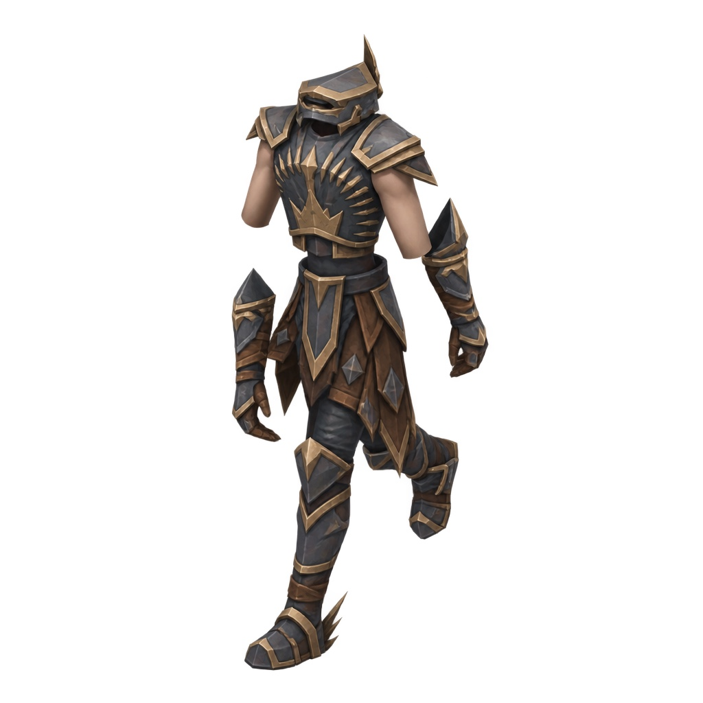
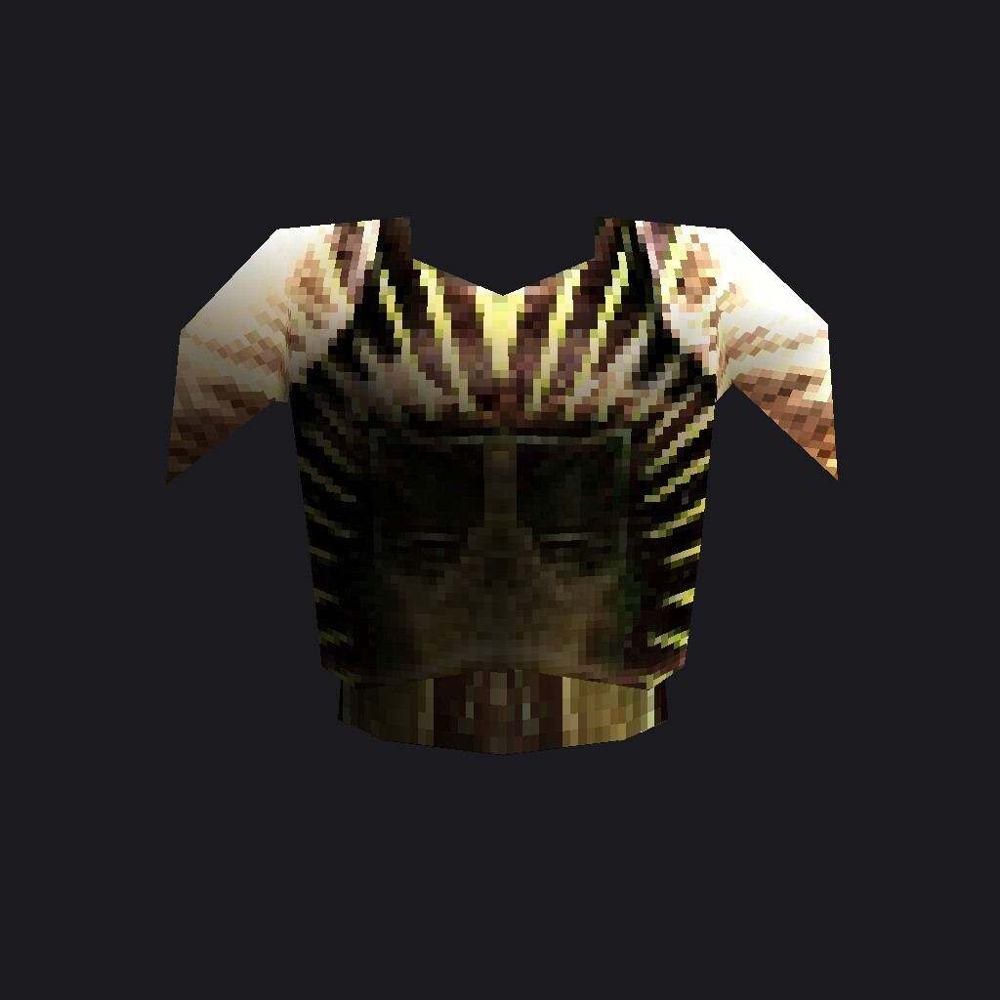
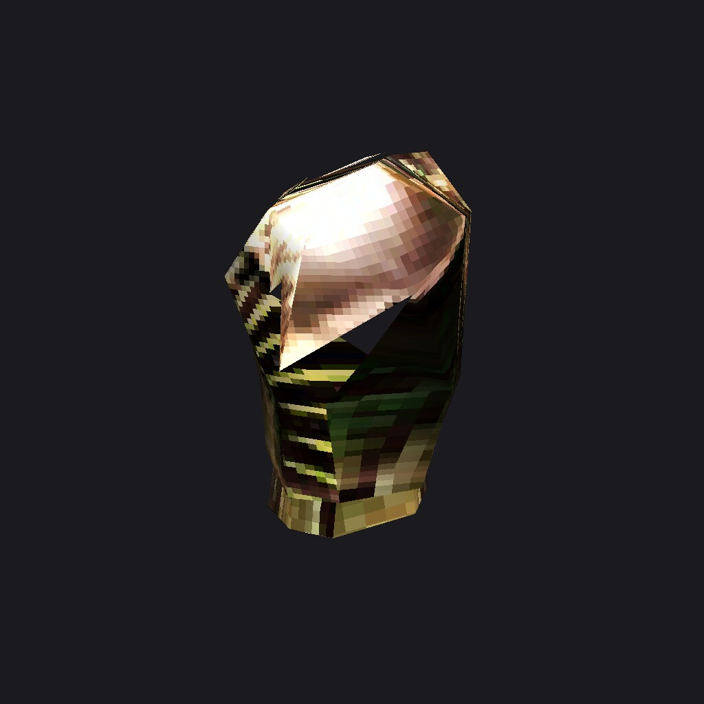
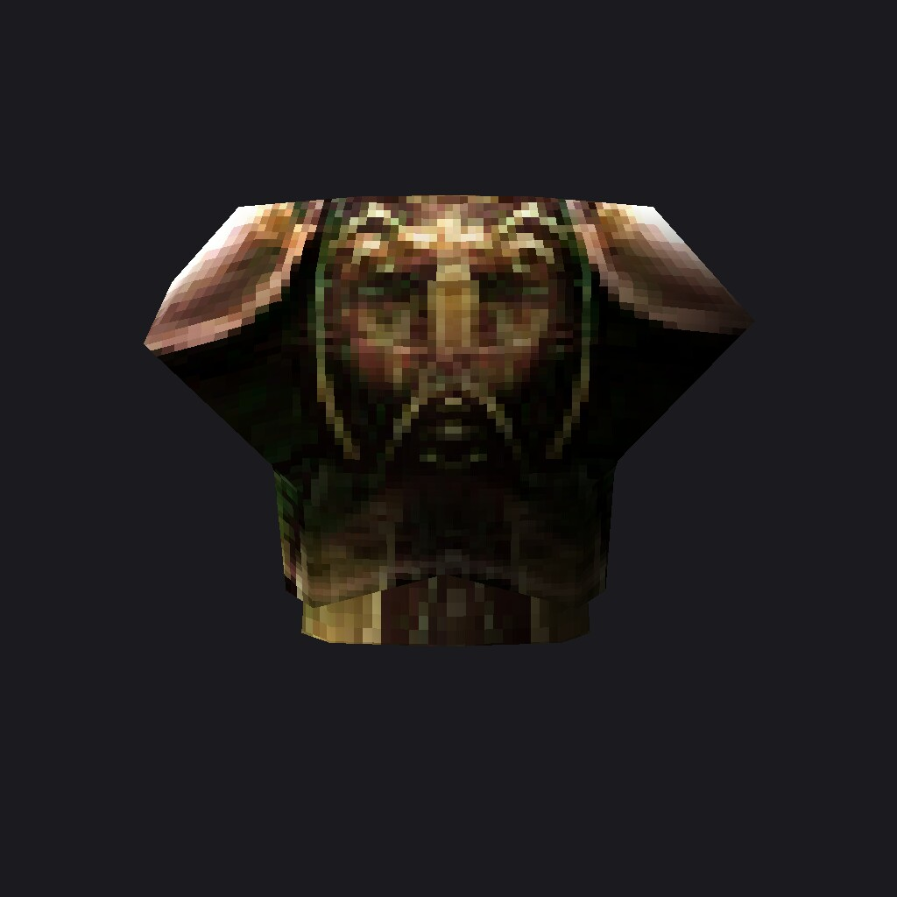
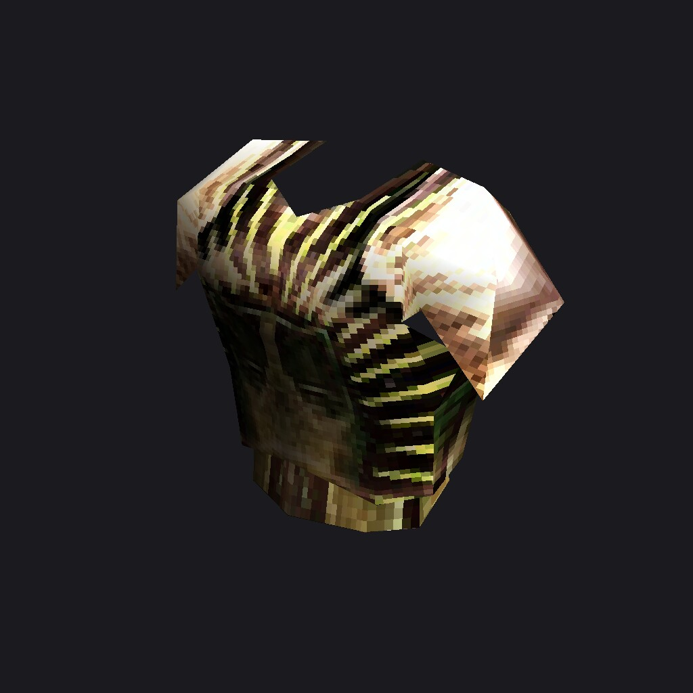
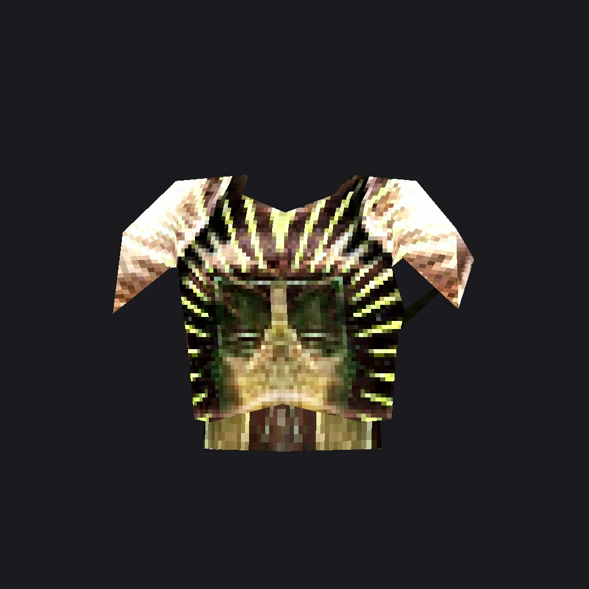
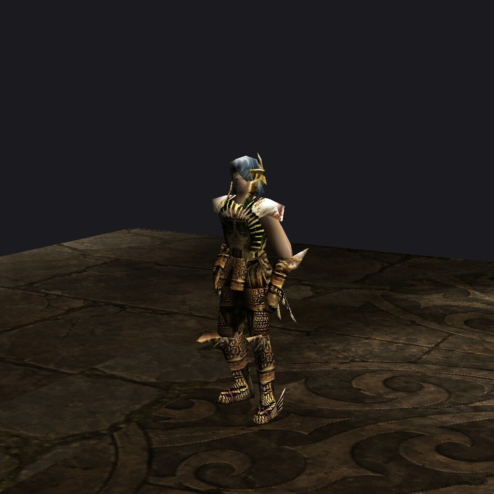
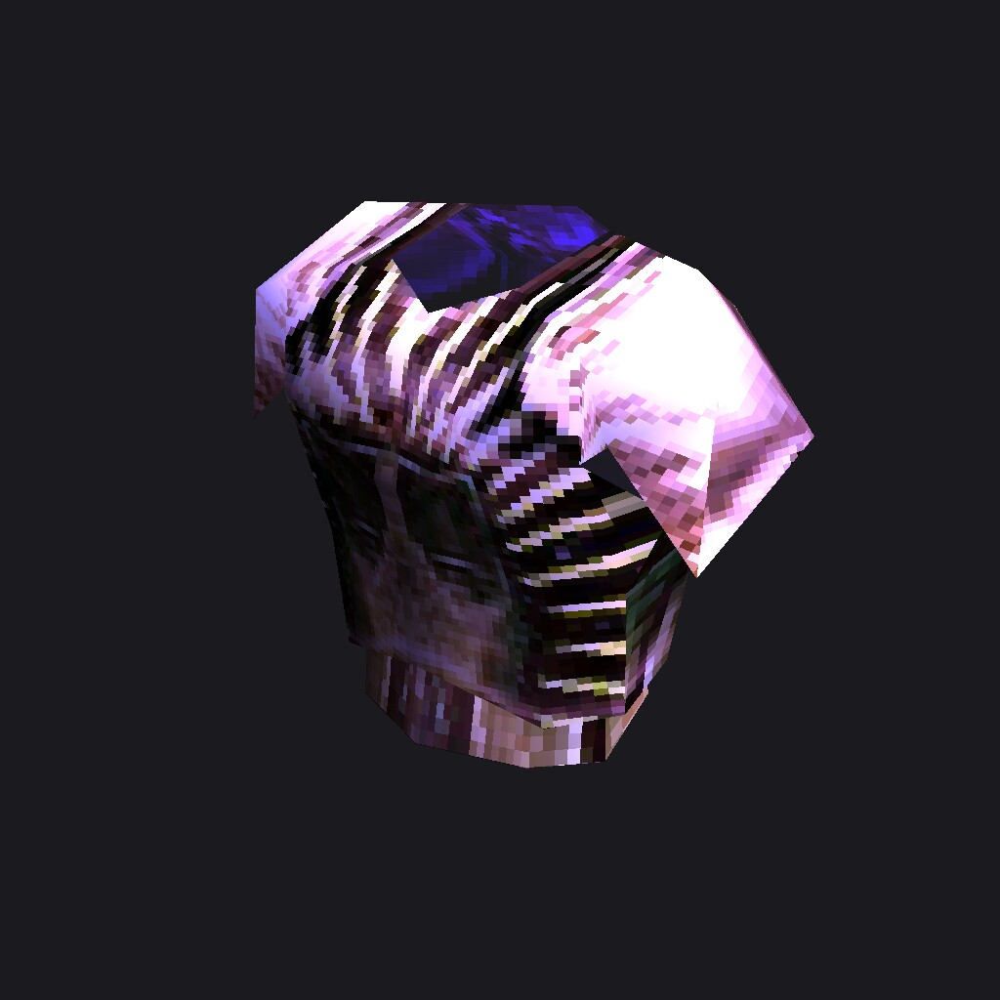
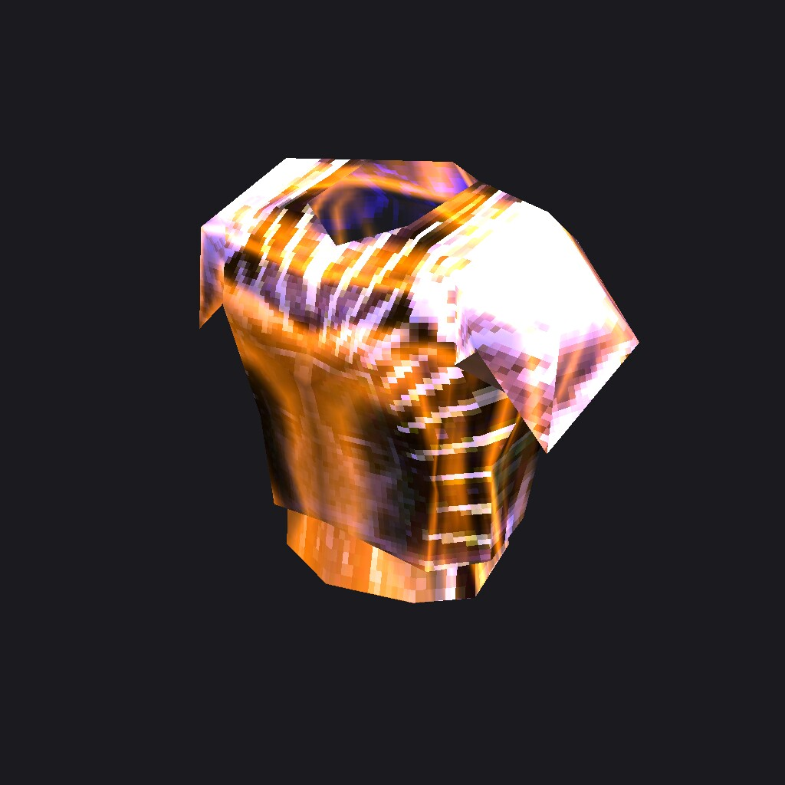
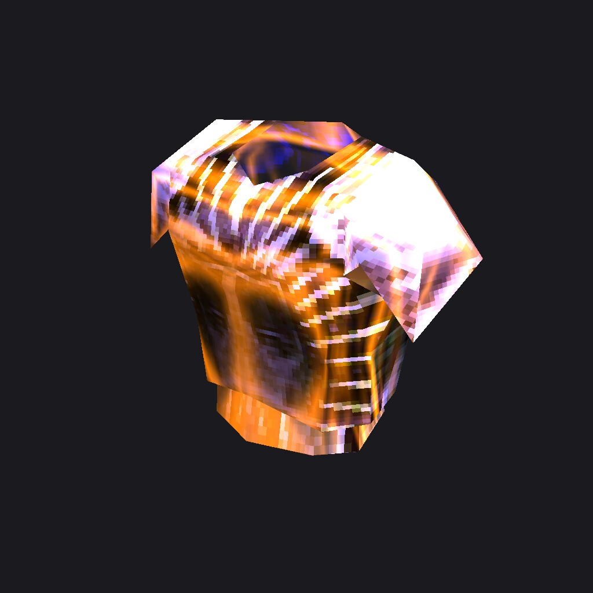

# Item request 2026-09-24-8-2-rebuild-pad-armor-rest

Rebuild Pad Armor and the rest of its armour set exactly as the picked concept

| | |
|---|---|
| Kind | set (redesign for every part) |
| Priority | normal |
| Status | open, filed 2026-09-24T13:15:54+02:00 from the item editor |
| Base commit | `90b7a6cdd9c4c921787d1552befac9b62a192b09` |
| Branch | `codex/item-req-8-2-rebuild-pad-armor-rest` |
| Deliver to | `assets-work/Items/requests/2026-09-24-8-2-rebuild-pad-armor-rest/delivery/` |
| Push allowed | no |

`request.json` next to this file is the contract; this brief repeats it for people. Work as [ASTRA.md](../../../../ASTRA.md) (weapons, armour) and the [worker rules](../README.md#worker-rules-codex) describe, and check the folder with
`python3 assets-work/Items/requests/validate_request.py assets-work/Items/requests/2026-09-24-8-2-rebuild-pad-armor-rest`.
The item keeps its group, index and file names; its name, stats, size and classes are not part of this request. The +level glow, excellent shine and ancient effect are engine code.

## What to change

Rebuild Pad Armor and the rest of its armour set exactly as the picked concept

- Match the attached concept (ref-concept.jpg) as closely as possible: shapes, colours, materials and details
- Where the game limits do not allow a detail, keep the closest simpler version

## Keep

- Same fit on the character, same animations, same inventory size

## Avoid

- Own design ideas that are not in the concept

## Reference images

## Targets

### Pad Armor (8-2)

- Family armours, tier T1, 2 x 2 inventory slots
- Armour set 2
- item: `src/bin/Data/Player/ArmorMale03.bmd`, 146 triangles, 3 meshes, SHA-256 at the base commit `1412b9e338fdca3f29ea8fb09f0e90c68260abca2806bbe3fb85e64bc0b76cc2` (you may replace it)
  - `hide_m.jpg`: no file (hidden or missing mesh texture)
  - `skin_barbarian_01.jpg` in `src/bin/Data/Player/skin_barbarian_01.OZJ` (frozen)
  - `upper_04_m.jpg` in `src/bin/Data/Player/upper_04_m.OZJ` (you may replace it)
- Original: revision `3d73f363f5755491d93a145fd85599c780f11d26`; every fact in [catalog.json](../../../../assets-work/Items/catalog.json) under `8-2`

### Pad Helm (7-2)

- Family helms, tier T1, 2 x 2 inventory slots
- Armour set 2
- item: `src/bin/Data/Player/HelmMale03.bmd`, 92 triangles, 2 meshes, SHA-256 at the base commit `f4d63e18797bbb401d2aa68dd1e926484c9e3d24502df99fb972741e952c6acf` (you may replace it)
  - `head_04.jpg` in `src/bin/Data/Player/head_04.OZJ` (you may replace it)
  - `hide.jpg`: no file (hidden or missing mesh texture)
- Original: revision `3d73f363f5755491d93a145fd85599c780f11d26`; every fact in [catalog.json](../../../../assets-work/Items/catalog.json) under `7-2`

### Pad Pants (9-2)

- Family pants, tier T1, 2 x 2 inventory slots
- Armour set 2
- item: `src/bin/Data/Player/PantMale03.bmd`, 132 triangles, 4 meshes, SHA-256 at the base commit `9b832295b088983b6b1acf3e7face2bb4f8ef0ea9d2984f9fac10d4acf9abe0e` (you may replace it)
  - `hide.jpg`: no file (hidden or missing mesh texture)
  - `lower_04_m.jpg` in `src/bin/Data/Player/lower_04_m.OZJ` (you may replace it)
  - `lower_04b_m.tga` in `src/bin/Data/Player/lower_04b_m.OZT` (you may replace it)
  - `lower_04c.tga` in `src/bin/Data/Player/lower_04c.OZT` (you may replace it)
- Original: revision `3d73f363f5755491d93a145fd85599c780f11d26`; every fact in [catalog.json](../../../../assets-work/Items/catalog.json) under `9-2`

### Pad Gloves (10-2)

- Family gloves, tier T1, 2 x 2 inventory slots
- Armour set 2
- item: `src/bin/Data/Player/GloveMale03.bmd`, 152 triangles, 2 meshes, SHA-256 at the base commit `ae5c1a9ca296681fd9c7b1b043065a3f5c62f618067529fa62d3f7227b297025` (you may replace it)
  - `gloves_04.jpg` in `src/bin/Data/Player/gloves_04.OZJ` (you may replace it)
  - `hide.jpg`: no file (hidden or missing mesh texture)
- Original: revision `3d73f363f5755491d93a145fd85599c780f11d26`; every fact in [catalog.json](../../../../assets-work/Items/catalog.json) under `10-2`

### Pad Boots (11-2)

- Family boots, tier T1, 2 x 2 inventory slots
- Armour set 2
- item: `src/bin/Data/Player/BootMale03.bmd`, 132 triangles, 3 meshes, SHA-256 at the base commit `6e758d670cc3ee5dbb6f6dcf2e7675b57ced5a95684a5655fe0ab6ff62b0edb8` (you may replace it)
  - `boots_04.jpg` in `src/bin/Data/Player/boots_04.OZJ` (you may replace it)
  - `boots_04b.tga` in `src/bin/Data/Player/boots_04b.ozt` (frozen)
  - `hide.jpg`: no file (hidden or missing mesh texture)
- Original: revision `3d73f363f5755491d93a145fd85599c780f11d26`; every fact in [catalog.json](../../../../assets-work/Items/catalog.json) under `11-2`

## How the game draws this item

From [render-facts.json](../../../../assets-work/Items/render-facts.json) (`constraints.render` in request.json); the modes are explained in [assets-work/Items/README.md](../../../../assets-work/Items/README.md#how-the-game-draws-items-blending-and-effects). A blended mesh is not an opaque texture: black adds nothing (additive) or the alpha cuts it out, so paint it for that.

### Pad Armor (8-2)

| Model | Mesh | Texture | Worn | Dropped | Inventory |
|---|---|---|---|---|---|
| `ArmorMale03.bmd` | 0 | `upper_04_m.jpg` | opaque | opaque | opaque |
| `ArmorMale03.bmd` | 1 | `hide_m.jpg` | hidden | hidden | hidden |
| `ArmorMale03.bmd` | 2 | `skin_barbarian_01.jpg` | opaque | hidden | hidden |

What the engine adds on top (never paint it into a texture):

- +level look: +3..+6 tinted light, +7 and up extra chrome/metal passes over the whole model
- Excellent: a second additive pass of the own texture in a pulsing purple/blue light (bright texels glow, black stays black)
- No item-specific effect in the scanned code: only the generic +level, excellent and ancient passes

### Pad Helm (7-2)

| Model | Mesh | Texture | Worn | Dropped | Inventory |
|---|---|---|---|---|---|
| `HelmMale03.bmd` | 0 | `head_04.jpg` | opaque | opaque | opaque |
| `HelmMale03.bmd` | 1 | `hide.jpg` | hidden | hidden | hidden |

What the engine adds on top (never paint it into a texture):

- +level look: +3..+6 tinted light, +7 and up extra chrome/metal passes over the whole model
- Excellent: a second additive pass of the own texture in a pulsing purple/blue light (bright texels glow, black stays black)
- No item-specific effect in the scanned code: only the generic +level, excellent and ancient passes

### Pad Pants (9-2)

| Model | Mesh | Texture | Worn | Dropped | Inventory |
|---|---|---|---|---|---|
| `PantMale03.bmd` | 0 | `lower_04_m.jpg` | opaque | opaque | opaque |
| `PantMale03.bmd` | 1 | `lower_04b_m.tga` | alpha-test | alpha-test | alpha-test |
| `PantMale03.bmd` | 2 | `hide.jpg` | hidden | hidden | hidden |
| `PantMale03.bmd` | 3 | `lower_04c.tga` | alpha-test | alpha-test | alpha-test |

What the engine adds on top (never paint it into a texture):

- +level look: +3..+6 tinted light, +7 and up extra chrome/metal passes over the whole model
- Excellent: a second additive pass of the own texture in a pulsing purple/blue light (bright texels glow, black stays black)
- No item-specific effect in the scanned code: only the generic +level, excellent and ancient passes

How to paint its blended and alpha meshes:

- Cut-out meshes of PantMale03.bmd (meshes 1, 3): the game discards texels at or below 25% alpha and blends the rest - keep the 32-bit .tga alpha as the silhouette; no opaque background, no matte fringe

### Pad Gloves (10-2)

| Model | Mesh | Texture | Worn | Dropped | Inventory |
|---|---|---|---|---|---|
| `GloveMale03.bmd` | 0 | `gloves_04.jpg` | opaque | opaque | opaque |
| `GloveMale03.bmd` | 1 | `hide.jpg` | hidden | hidden | hidden |

What the engine adds on top (never paint it into a texture):

- +level look: +3..+6 tinted light, +7 and up extra chrome/metal passes over the whole model
- Excellent: a second additive pass of the own texture in a pulsing purple/blue light (bright texels glow, black stays black)
- No item-specific effect in the scanned code: only the generic +level, excellent and ancient passes

### Pad Boots (11-2)

| Model | Mesh | Texture | Worn | Dropped | Inventory |
|---|---|---|---|---|---|
| `BootMale03.bmd` | 0 | `boots_04.jpg` | opaque | opaque | opaque |
| `BootMale03.bmd` | 1 | `hide.jpg` | hidden | hidden | hidden |
| `BootMale03.bmd` | 2 | `boots_04b.tga` | alpha-test | alpha-test | alpha-test |

What the engine adds on top (never paint it into a texture):

- +level look: +3..+6 tinted light, +7 and up extra chrome/metal passes over the whole model
- Excellent: a second additive pass of the own texture in a pulsing purple/blue light (bright texels glow, black stays black)
- No item-specific effect in the scanned code: only the generic +level, excellent and ancient passes

How to paint its blended and alpha meshes:

- Cut-out meshes of BootMale03.bmd (mesh 2): the game discards texels at or below 25% alpha and blends the rest - keep the 32-bit .tga alpha as the silhouette; no opaque background, no matte fringe

## Files you may replace

- src/bin/Data/Player/ArmorMale03.bmd
- src/bin/Data/Player/BootMale03.bmd
- src/bin/Data/Player/GloveMale03.bmd
- src/bin/Data/Player/HelmMale03.bmd
- src/bin/Data/Player/PantMale03.bmd
- src/bin/Data/Player/boots_04.OZJ
- src/bin/Data/Player/gloves_04.OZJ
- src/bin/Data/Player/head_04.OZJ
- src/bin/Data/Player/lower_04_m.OZJ
- src/bin/Data/Player/lower_04b_m.OZT
- src/bin/Data/Player/lower_04c.OZT
- src/bin/Data/Player/upper_04_m.OZJ

## Frozen textures (keep byte-identical)

- src/bin/Data/Player/boots_04b.ozt
- src/bin/Data/Player/skin_barbarian_01.OZJ

## Shared textures

- `src/bin/Data/Player/boots_04b.ozt`: 11-2 11-10
- `src/bin/Data/Player/skin_barbarian_01.OZJ`: 7-1 7-5 7-6 7-7 7-8 8-0 8-2 8-5 other:MODEL_BODY_ARMOR other:MODEL_BODY_BOOTS other:MODEL_BODY_GLOVES other:MODEL_BODY_HELM other:MODEL_BODY_PANTS

## Must keep

- File names and paths: no renamed, added or deleted game files
- Origin, orientation and scale: hands, back and shields attach through the model origin (RenderLinkObject angles are hard-coded)
- Mesh count and mesh/material order (the engine hides and blends meshes by index)
- Texture name suffixes _R, _S, _H, _N (they set render flags); no new ones
- At most 1500 triangles per model; power-of-two textures up to 1024 px, .jpg opaque, 32-bit .tga for alpha
- Armour and wings: the skeleton (bone count, order, names, parents) and every action with its key count
- Size in the inventory (Width x Height of the item table) and a footprint that fits it
- Redesign: origin, grip, size in the inventory slot and mesh order
- Set: every part keeps its skeleton and actions, and the parts still read as one set
- Cut-out meshes of PantMale03.bmd (meshes 1, 3): the game discards texels at or below 25% alpha and blends the rest - keep the 32-bit .tga alpha as the silhouette; no opaque background, no matte fringe
- Cut-out meshes of BootMale03.bmd (mesh 2): the game discards texels at or below 25% alpha and blends the rest - keep the 32-bit .tga alpha as the silhouette; no opaque background, no matte fringe

## Evidence

In-client captures of the current look without the editor, client commit `90b7a6cd`.

turntable at 0 degrees, +0, 1024x1024

turntable at 90 degrees, +0, 1024x1024

turntable at 180 degrees, +0, 1024x1024

turntable at 45 degrees, +0, 1024x1024

inventory, +0, 1024x1024

equipped-front, +0, 1024x1024

glow, +0 excellent, 1024x1024

glow, +9 excellent, 1024x1024

glow, +13 excellent, 1024x1024

